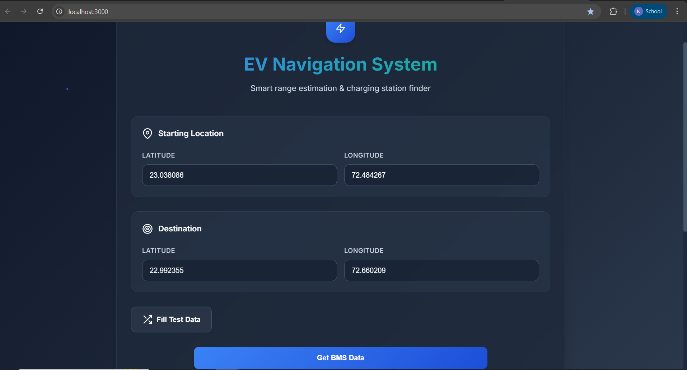
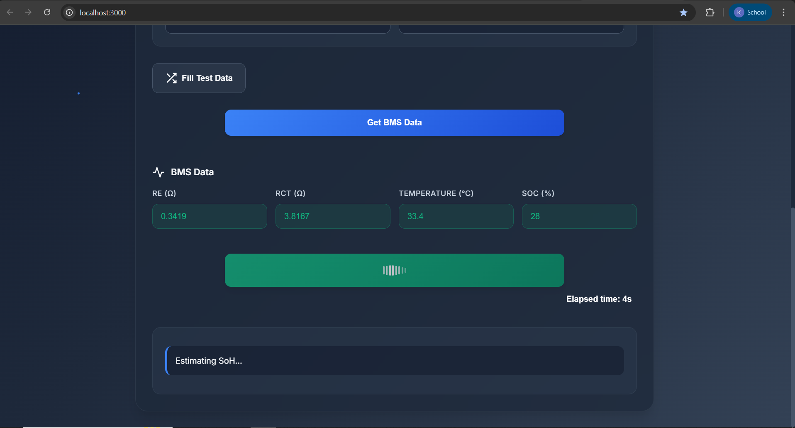
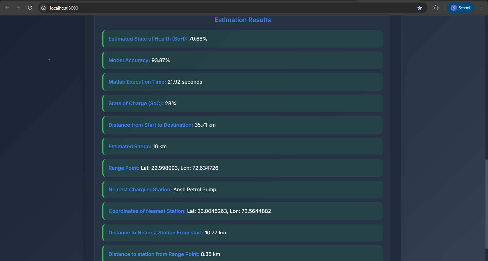

# EV Battery Navigation System

Smart range estimation & charging station finder for Electric Vehicles (EVs). This project combines MATLAB-based battery health modeling with a Node.js web backend and interactive frontend to estimate EV range, SoH/SoC, and suggest optimal charging stations along a route.

---

## Features

- **State of Health (SoH) Estimation:** Uses MATLAB models trained on real battery datasets.
- **Range Prediction:** Calculates estimated driving range based on battery parameters and driving conditions.
- **Route Analysis:** Computes road distance between start and destination using OpenRouteService API.
- **Charging Station Finder:** Finds nearest charging stations within range using OpenStreetMap data.
- **Interactive Web UI:** User-friendly interface for inputting locations and battery data, with real-time results and progress feedback.

---

## Project Structure

```
src/
  models/           # MATLAB scripts for SoH/SoC estimation and training
  navigation/       # MATLAB scripts for station finding and route planning
  training_data/    # Battery datasets (.mat files)
  utils/            # MATLAB utility scripts (JSON I/O, OSM data fetch)
  web/
    app.js          # Node.js Express backend
    train_and_estimate.m # MATLAB script called by backend
    static/
      index.html    # Main web UI
      main.js       # Frontend logic
      style.css     # UI styles
    data/
      road_data.json
      petrol_pump_data.json
      matlab_output.json
    .env            # API keys and environment variables
README.md
```

---

## How It Works

1. **User Inputs:** Start/destination coordinates, battery impedance (Re, Rct), temperature, SoC.
2. **Backend Processing:**
   - Calls MATLAB (`train_and_estimate.m`) to estimate SoH using trained models ([src/models/train_soh_model.m](src/models/train_soh_model.m)).
   - Predicts range using [`calculateRange`](src/web/app.js).
   - Uses OpenRouteService API to get road distance.
   - Finds nearest charging station within range using OSM data ([src/utils/fetch_osm_data.m](src/utils/fetch_osm_data.m)).
3. **Frontend:** Displays results (SoH, SoC, range, nearest station, distances) with progress feedback.

---

## Setup & Installation

1. **Clone the repo:**
   ```sh
   git clone https://github.com/KailashDusad/EVs.git
   cd EVs/src/web
   ```

2. **Install Node.js dependencies:**
   ```sh
   npm install
   ```

3. **Configure .env:**
   - Add your OpenRouteService API key to `.env`:
     ```
     ORS_API_KEY=your_api_key_here
     ```

4. **MATLAB Requirements:**
   - MATLAB must be installed and accessible from command line.
   - All `.m` scripts and `.mat` data files should be in place.

5. **Fetch OSM Data (optional):**
   - Run [`fetch_osm_data`](src/utils/fetch_osm_data.m) in MATLAB to update road and station data.

6. **Start the server:**
   ```sh
   node app.js
   ```
   - Visit [http://localhost:3000](http://localhost:3000) in your browser.

---

## Key Files

- **Backend:** [`app.js`](src/web/app.js)
- **MATLAB Model:** [`train_and_estimate.m`](src/web/train_and_estimate.m)
- **Frontend:** [`index.html`](src/web/static/index.html), [`main.js`](src/web/static/main.js), [`style.css`](src/web/static/style.css)
- **Data:** [`road_data.json`](src/web/data/road_data.json), [`petrol_pump_data.json`](src/web/data/petrol_pump_data.json)

---

## Example Workflow

1. Enter start/destination coordinates.
2. Click "Get BMS Data" to auto-fill battery parameters.
3. Click "Run Estimation" to see:
   - Estimated SoH, SoC, range
   - Road distance to destination
   - Nearest charging station (name, coordinates, distances)
   - Model accuracy and MATLAB execution time

---

## Technologies Used

- **MATLAB:** Battery modeling, machine learning, data processing
- **Node.js (Express):** Web backend, API integration
- **HTML/CSS/JS:** Interactive frontend
- **OpenRouteService API:** Road distance calculation
- **OpenStreetMap:** Charging station and road data

---

## Screenshots





---

## Acknowledgements

- Battery datasets from NASA Prognostics Center
- OpenRouteService & OpenStreetMap APIs

---

## Contact

For questions or collaboration, open an issue or contact [your.email@example.com](mailto:your.email@example.com).
